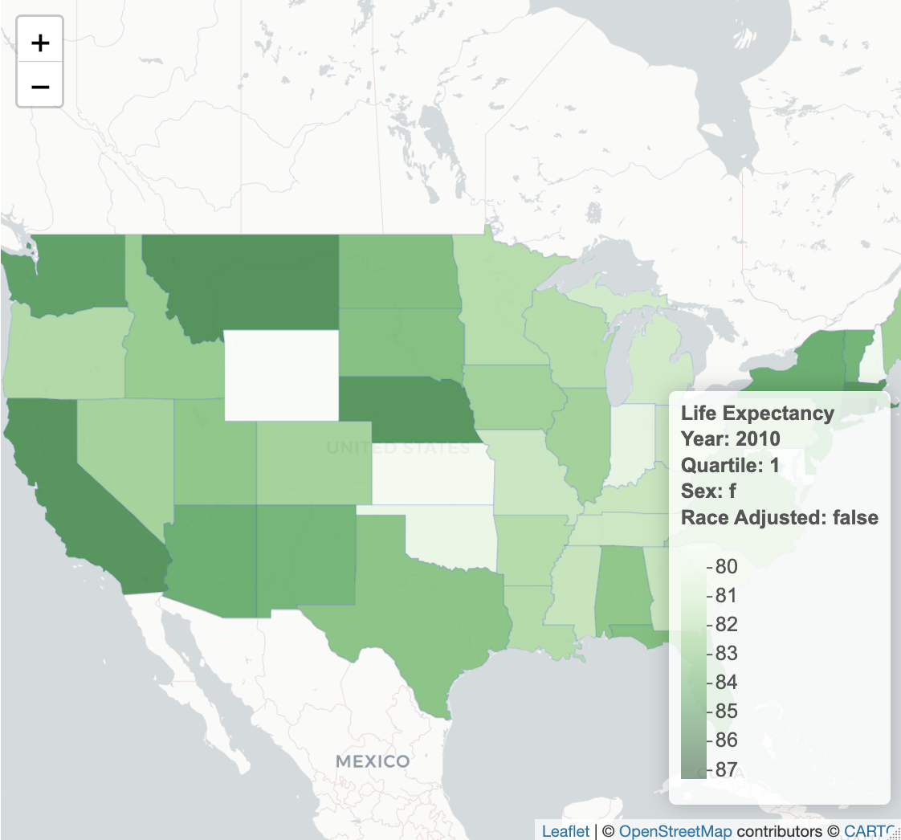

<!-- README.md is generated from README.Rmd. Please edit that file -->

```{r, include = FALSE}
knitr::opts_chunk$set(
  collapse = TRUE,
  comment = "#>",
  fig.path = "man/figures/README-",
  out.width = "100%"
)
```

# livelongr

<!-- badges: start -->
<!-- badges: end -->

The goal of `livelongr` is to analyze and create visualization of life expectancy in America.

## Installation

You can install the development version of livelongr from [GitHub](https://github.com/) with:

``` {r}
# install.packages("devtools")
devtools::install_github("harvard-stat108s23/project2-group11")
```

## About the data

Data were collected from Raj Chetty's [The Health Inequality Project](https://healthinequality.org/) and [FRED](https://fred.stlouisfed.org/)

The livelongr package contains one dataset called `health_ineq`, which is a merged dataset consisting of life expectation estimates at age 40 across income quartiles, gender, state, year, race adjusted vs unadjusted, and the minimum wage rate for that state. In this dataset, there are 4 quartiles with 1 being the poorest and 4 being the wealthiest. 

```{r showdata}
library(livelongr)
data(package = "livelongr")
```

For more info:

```{r example-livelongr}
head(health_ineq)
```

## Why should I use this package?

The livelongr package provides visually appealing graphics, like interactive choropleths or still scatterplots, using life expectation estimates across income quartiles, gender, state, year, and the minimum wage of that state. Both race adjusted and unadjusted estimates are included. 

You can find out interesting facts, such as the broad question of "Which state has the highest life expectancy?", or dive deeper and ask a more specific question like "Which state has the highest race-adjusted life expectancy for females in the 1st income (poorest) quartile in 2010?". 

Using `choropleth()`:
```{r, eval = FALSE}
library(livelongr)
#the default is ra = TRUE, meaning race-adjusted
choropleth(health_ineq, 1, "f", 2010)
```

```{r, echo = FALSE}
#image was attached instead because I couldn't run the interactive code chunk to .md
knitr::include_graphics("images/plot1.png")
```

In the above interactive graph, you can inspect each state and look for the darkest colored ones for the highest life expectancy estimate. You can also click on each state to get precise numbers to the nearest hundredth for life expectancy for that selected state. In this graph of females at age 40 in the 1st quartile in 2010, Alaska, Rhode Island, Montana, and Nebraska are the highest with values of 87.04, 86.41, 85.5, and 85.4 years, respectively. Additionally, the legend scale informs you that there's a 7 year difference in life expectancy across different states with the lowest being approximately 80 years, which is still quite high!

To see a race-unadjusted:
```{r, eval = FALSE}
library(livelongr)
#the default is ra = TRUE, meaning race-adjusted
#switching ra = FALSE means race-unadjusted
choropleth(health_ineq, 1, "f", 2010, ra = FALSE)
```

```{r, echo = FALSE}
#image was attached instead because I couldn't run the interactive code chunk to .md

```

The race adjusted and unadjusted maps look relatively similar, however, if we click on a particular state like Alaska, we see that the life expectancy estimate is slightly higher for race unadjusted (87.27 years) in comparison to race adjusted (87.40 years). 


Furthermore, if you want to compare life expectancy and minimum wage, the `wage_le_plot()` function allows you to do so.

Using `wage_le_plot()`:

```{r}
library(livelongr)
# the default is all years
wage_le_plot(health_ineq, 1, state = c("FL", "NY", "CA", "MA", "GA", "CT", "PA"), sex = "f")
```
Here, we choose 7 states (Florida, New York, California, Massachusetts, Georgia, Connecticut, Pennsylvania) and plot their respective life expectancy and minimum wages. Immediately, we see that there's stacking at the 5.2 dollar, 6.7 dollar and 8 dollar ranges. This means that of our chosen states, their minimum wages have either previously been or currently is at that rate, since the default is to include all years. One noticeable trend is that life expectancy seems to be highest at the 8 dollar minimum wage rate with Massachusetts (MA) being the highest. This high life expectancy, however, may not be entirely due to minimum wage as their are other confounding variables such as age, pollution, exercise, diet, genetics, smoking, etc. 


## References

The Association between Income and Life Expectancy in the United States, 2001 - 2014. Raj Chetty et al. The Journal of the American Medical Association, April 11, 2016, Vol 315, No. 14. <https://healthinequality.org/>

Min wage and Poverty data: <https://fred.stlouisfed.org/>
