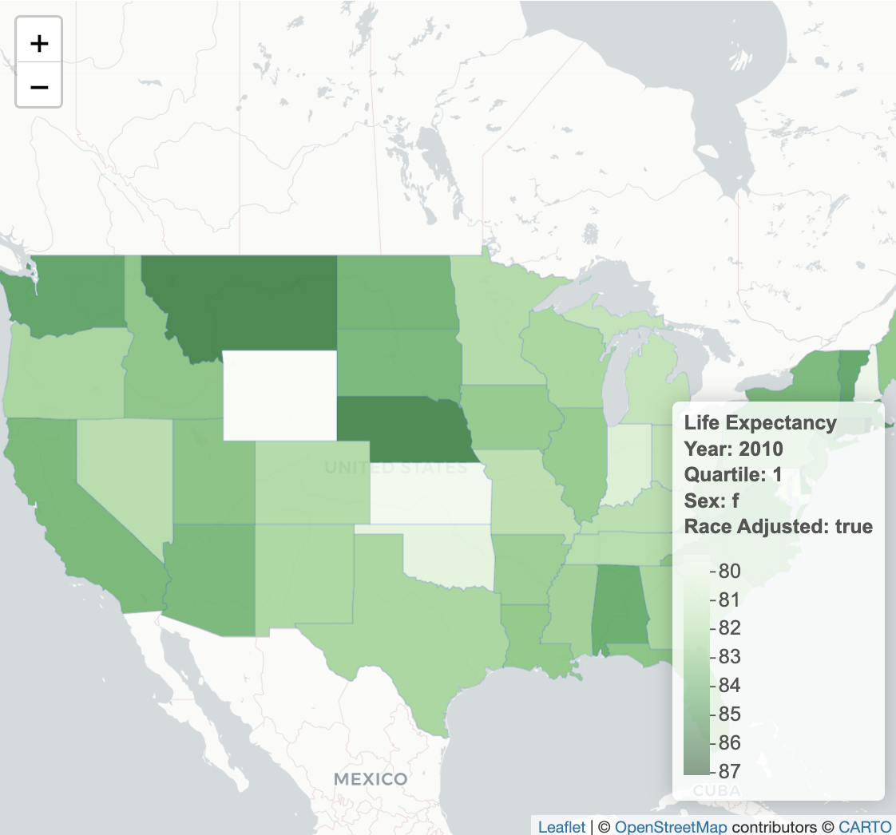
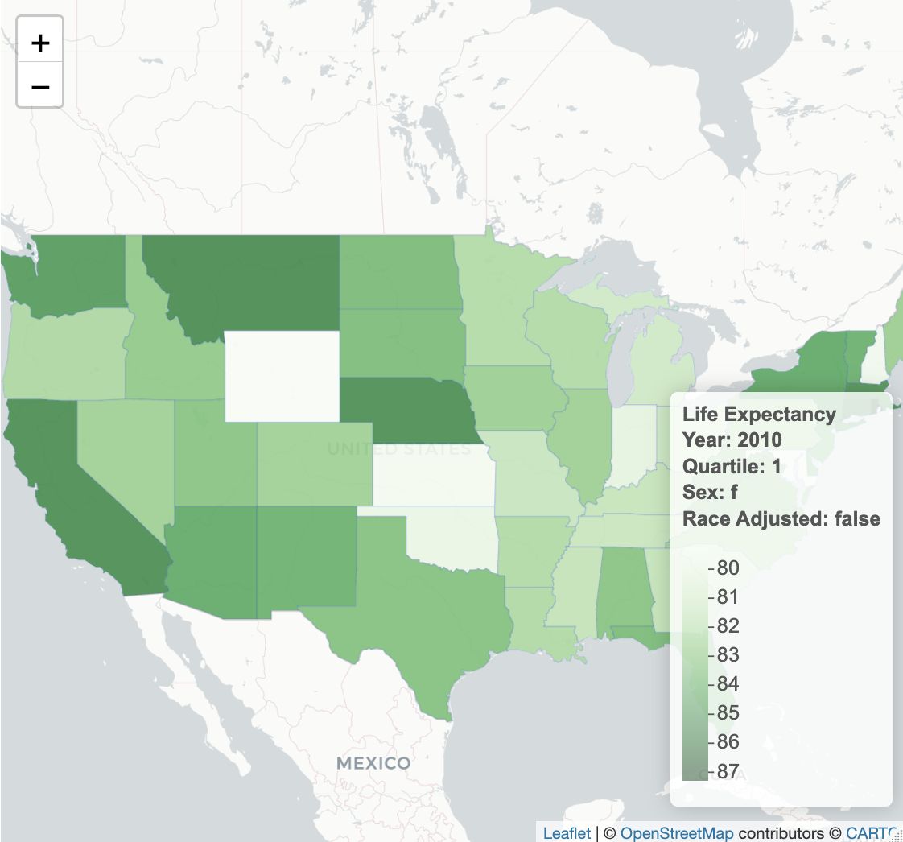
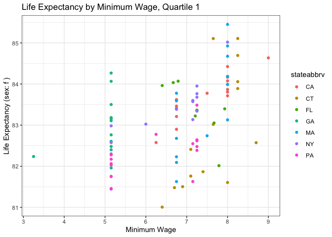

<!-- README.md is generated from README.Rmd. Please edit that file -->

# livelongr

<!-- badges: start -->
<!-- badges: end -->

The goal of `livelongr` is to analyze and create visualization of life
expectancy in America.

## Installation

You can install the development version of livelongr from
[GitHub](https://github.com/) with:

``` r
# install.packages("devtools")
devtools::install_github("harvard-stat108s23/project2-group11")
#> Using github PAT from envvar GITHUB_PAT
#> Downloading GitHub repo harvard-stat108s23/project2-group11@HEAD
#> 
#> ── R CMD build ─────────────────────────────────────────────────────────────────
#> * checking for file ‘/private/var/folders/s_/1x1gtdkd2j9f57_1_qkpq_mm0000gn/T/RtmpYzGZfv/remotes9bcc3402ef4a/harvard-stat108s23-livelongr-c087f6197424671769c92a82598d1d9f3b778cfd/DESCRIPTION’ ... OK
#> * preparing ‘livelongr’:
#> * checking DESCRIPTION meta-information ... OK
#> * checking for LF line-endings in source and make files and shell scripts
#> * checking for empty or unneeded directories
#> * building ‘livelongr_1.0.0.tar.gz’
#> Installing package into '/private/var/folders/s_/1x1gtdkd2j9f57_1_qkpq_mm0000gn/T/RtmpPj9V89/temp_libpath38504c17cf44'
#> (as 'lib' is unspecified)
```

## About the data

Data were collected from Raj Chetty’s [The Health Inequality
Project](https://healthinequality.org/) and
[FRED](https://fred.stlouisfed.org/)

The livelongr package contains one dataset called `health_ineq`, which
is a merged dataset consisting of life expectation estimates at age 40
across income quartiles, gender, state, year, race adjusted vs
unadjusted, and the minimum wage rate for that state. In this dataset,
there are 4 quartiles with 1 being the poorest and 4 being the
wealthiest.

``` r
library(livelongr)
data(package = "livelongr")
```

For more info:

``` r
head(health_ineq)
#>   stateabbrv Year statename  ra_q1_f  ra_q2_f  ra_q3_f  ra_q4_f  ra_q1_m
#> 1         AK 2001    Alaska 85.84044 82.31258 84.18246 86.80753 78.80679
#> 2         AK 2002    Alaska 86.53541 80.80454 89.14766 88.56842 78.90601
#> 3         AK 2003    Alaska 84.10070 85.58404 85.04288 82.18699 77.27293
#> 4         AK 2004    Alaska 83.79054 88.09527 86.28185 91.20775 77.45926
#> 5         AK 2005    Alaska 83.97840 85.70750 83.62022 87.52561 76.74271
#> 6         AK 2006    Alaska 85.02107 89.18044 86.51068 89.71983 77.52149
#>    ra_q2_m  ra_q3_m  ra_q4_m  nr_q1_f  nr_q2_f  nr_q3_f  nr_q4_f  nr_q1_m
#> 1 82.79369 80.32292 86.23465 86.04274 82.33748 84.41045 86.75902 78.72337
#> 2 78.72609 84.26761 85.72091 86.74393 80.76041 89.32250 88.56802 78.82304
#> 3 83.54868 81.29212 79.99159 84.31139 85.66699 85.27372 82.00671 77.16081
#> 4 82.04703 84.51955 87.06063 83.99380 88.17509 86.50045 91.23225 77.35510
#> 5 80.92330 86.71595 85.57415 84.21471 85.77379 83.86731 87.49517 76.62862
#> 6 80.77792 82.92734 89.78299 85.22330 89.26977 86.74304 89.73344 77.42030
#>    nr_q2_m  nr_q3_m  nr_q4_m ra_q1_mixed ra_q2_mixed ra_q3_mixed ra_q4_mixed
#> 1 82.59918 80.18698 86.09869    82.32362    82.55313    82.25269    86.52109
#> 2 78.46381 84.21545 85.55241    82.72071    79.76531    86.70763    87.14466
#> 3 83.36965 81.17433 79.65434    80.68682    84.56636    83.16750    81.08929
#> 4 81.83656 84.44209 86.92503    80.62490    85.07115    85.40070    89.13419
#> 5 80.65938 86.70511 85.35341    80.36055    83.31540    85.16808    86.54988
#> 6 80.49155 82.83405 89.73946    81.27128    84.97918    84.71901    89.75141
#>   nr_q1_mixed nr_q2_mixed nr_q3_mixed nr_q4_mixed Min_Wage
#> 1    82.38306    82.46833    82.29871    86.42885     5.65
#> 2    82.78348    79.61211    86.76897    87.06021     5.65
#> 3    80.73610    84.51832    83.22403    80.83052     7.15
#> 4    80.67445    85.00583    85.47127    89.07864     7.15
#> 5    80.42166    83.21658    85.28621    86.42429     7.15
#> 6    81.32180    84.88066    84.78854    89.73645     7.15
```

## Why should I use this package?

The livelongr package provides visually appealing graphics, like
interactive choropleths or still scatterplots, using life expectation
estimates across income quartiles, gender, state, year, and the minimum
wage of that state. Both race adjusted and unadjusted estimates are
included.

You can find out interesting facts, such as the broad question of “Which
state has the highest life expectancy?”, or dive deeper and ask a more
specific question like “Which state has the highest race-adjusted life
expectancy for females in the 1st income (poorest) quartile in 2010?”.

Using `choropleth()`:

``` r
library(livelongr)
#the default is ra = TRUE, meaning race-adjusted
choropleth(health_ineq, 1, "f", 2010)
```



In the above interactive graph, you can inspect each state and look for
the darkest colored ones for the highest life expectancy estimate. You
can also click on each state to get precise numbers to the nearest
hundredth for life expectancy for that selected state. In this graph of
females at age 40 in the 1st quartile in 2010, Alaska, Rhode Island,
Montana, and Nebraska are the highest with values of 87.04, 86.41, 85.5,
and 85.4 years, respectively. Additionally, the legend scale informs you
that there’s a 7 year difference in life expectancy across different
states with the lowest being approximately 80 years, which is still
quite high!

To see a race-unadjusted:

``` r
library(livelongr)
#the default is ra = TRUE, meaning race-adjusted
#switching ra = FALSE means race-unadjusted
choropleth(health_ineq, 1, "f", 2010, ra = FALSE)
```



The race adjusted and unadjusted maps look relatively similar, however,
if we click on a particular state like Alaska, we see that the life
expectancy estimate is slightly higher for race unadjusted (87.27 years)
in comparison to race adjusted (87.40 years).

Furthermore, if you want to compare life expectancy and minimum wage,
the `wage_le_plot()` function allows you to do so.

Using `wage_le_plot()`:

``` r
library(livelongr)
# the default is all years
wage_le_plot(health_ineq, 1, state = c("FL", "NY", "CA", "MA", "GA", "CT", "PA"), sex = "f")
#> Warning in wage_le_plot(health_ineq, 1, state = c("FL", "NY", "CA", "MA", : No
#> minimum wage values found for at least one specified state/year combination.
#> Warning: Removed 5 rows containing missing values (`geom_point()`).
```


Here, we choose 7 states (Florida, New York, California, Massachusetts,
Georgia, Connecticut, Pennsylvania) and plot their respective life
expectancy and minimum wages. Immediately, we see that there’s stacking
at the 5.2 dollar, 6.7 dollar and 8 dollar ranges. This means that of
our chosen states, their minimum wages have either previously been or
currently is at that rate, since the default is to include all years.
One noticeable trend is that life expectancy seems to be highest at the
8 dollar minimum wage rate with Massachusetts (MA) being the highest.
This high life expectancy, however, may not be entirely due to minimum
wage as their are other confounding variables such as age, pollution,
exercise, diet, genetics, smoking, etc.

## References

The Association between Income and Life Expectancy in the United States,
2001 - 2014. Raj Chetty et al. The Journal of the American Medical
Association, April 11, 2016, Vol 315, No. 14.
<https://healthinequality.org/>

Min wage and Poverty data: <https://fred.stlouisfed.org/>
